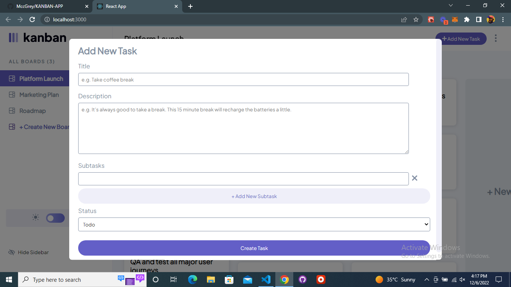

## Table of contents

- [Overview](#overview)
  - [The challenge](#the-challenge)
  - [Links](#links)
- [My process](#my-process)
  - [Built with](#built-with)
  - [What I learned](#what-i-learned)
  - [Continued development](#continued-development)
- [Author](#author)

## Overview

### The challenge

Users should be able to:

- View the optimal layout for the app depending on their device's screen size
- See hover states for all interactive elements on the page
- Create, read, update, and delete boards and tasks
- Receive form validations when trying to create/edit boards and tasks
- Mark subtasks as complete and move tasks between columns
- Hide/show the board sidebar
- Toggle the theme between light/dark modes
- **Bonus**: Allow users to drag and drop tasks to change their status and re-order them in a column
- **Bonus**: Keep track of any changes, even after refreshing the browser (`localStorage` could be used for this if you're not building out a full-stack app)
- **Bonus**: Build this project as a full-stack application

### Links

- Live Site URL: [MccGre-Kanban-App](https://mccgrey-kanbanapp.netlify.app/)

### Built with

- Semantic HTML5 markup
- CSS custom properties
- Flexbox
- Mobile-first workflow
- [React](https://reactjs.org/) - JS library
- [Styled Components](https://styled-components.com/) - For styles

### What I learned

I mainly learnt how to persist complex state with localstorage and how to make use of the 'PersistGate' library for redux.

## Author

### AGUONYE CORNELIUS (MCCGREY)

- LinkedIn - [@mccgrey](https://www.linkedin.com/in/mccgrey)
- Twitter - [@browncheese6](https://www.twitter.com/browncheese6)
- Github - [@MccGrey](https://github.com/MccGrey)
